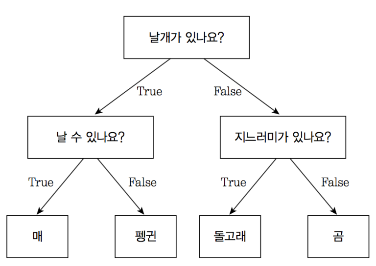
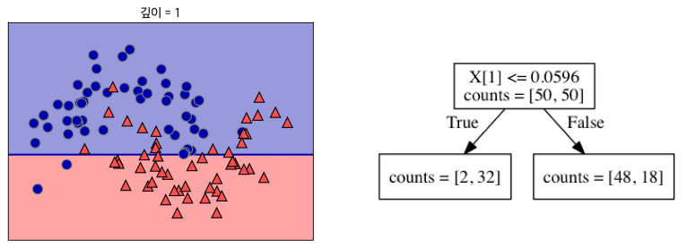
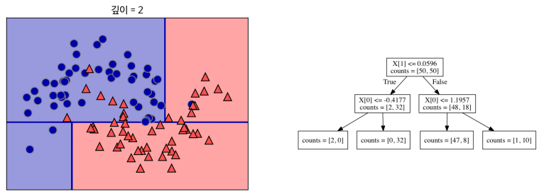
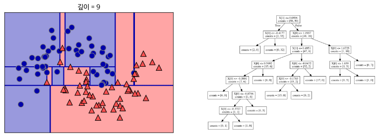
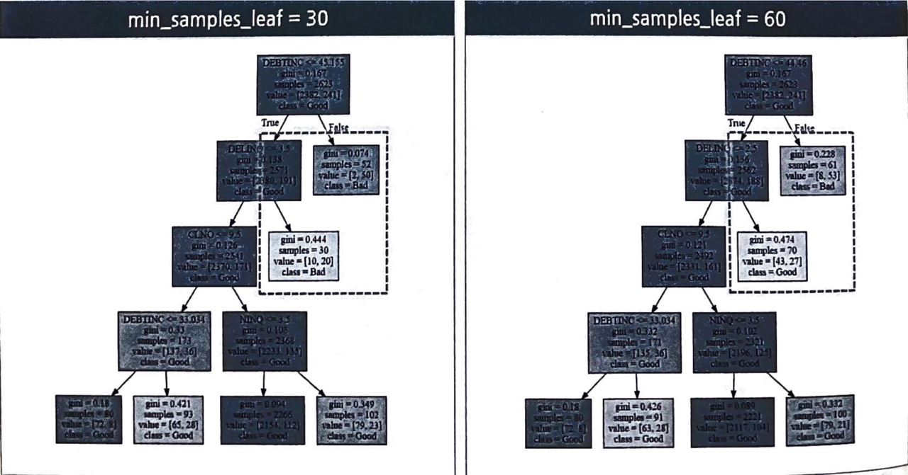
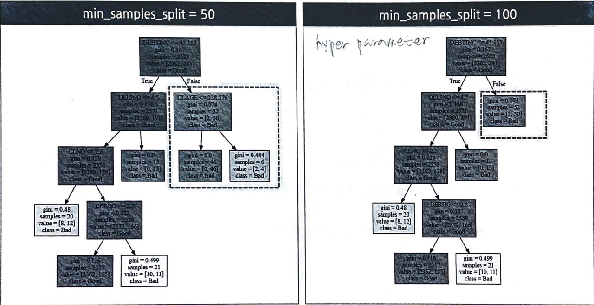
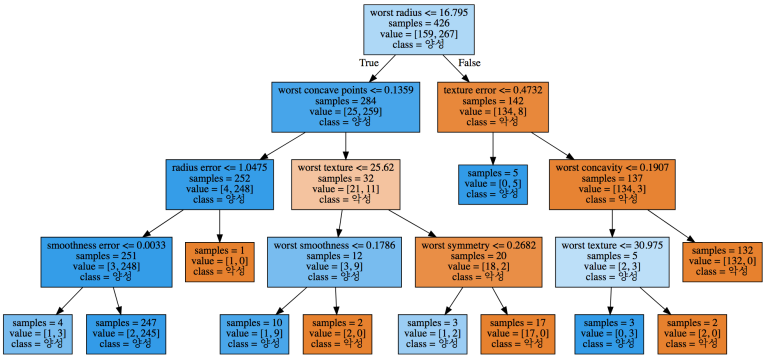

# 의사결정나무(Decision Tree)

### 정의
### : 설명변수들의 규칙, 관계, 패턴 등으로 관심 대상인 목표변수를 분류하는 나무 구조의 모델을 만들고, 설명변수의 값을 생성된 모델에 입력해 목표변수를 분류/에측하는 지도학습 기법

결정 트리는 결정에 다다르기 위해 예/아니오 질문을 이어 나가면서 학습  

곰, 매, 펭귄, 돌고래라는 네 가지 동물을 구분한다고 하면, 우리의 목표는 가능한 한 적은 예/아니오 질문으로 문제를 해결하는 것.  

  
출처 : 텐서 플로우 블로그  

- 한 번의 분기마다 변수 영역을 두 개로 구분.  
- 질문이나 정답을 담은 네모 상자를 노드(Node)라 한다.  
- 맨 처음 분류 기준을 Root Node, 맨 마지막 노드를 Terminal Node 또는 Leaf Node라고 한다.  

> - 목표변수에 영향을 주는 설명변수를 탐색하고 해당 설명변수의 최적 분리기준을 제시
  
> 분류(classification)는 범주형 레이블을 예측
>  > - 은행 입장에서 대출을 요청하는 고객의 특성에 따른 대출 위험성을 분석해 대출 여부를 결정
>  > - 고객 프로파일 및 구매 패턴을 분석해 새로운 제품 구매 여부를 판단
>  > - 환자 특성과 상태에 따라 특정 처방의 적절성 여부를 예측  
  
> 회귀(regreesion)는 목표변수의 평균값을 예측
>  > - 다양한 신체 측정값을 기반으로 체질 비만도 예측
>  > - 주택가격에 영향을 주는 다양한 요인을 분석해 주택 특성별 가격 예측
>  > - 고객 프로파일 및 구매 패턴에 따른 (특정) 제품 또는 매장의 매출액 예측

### 활용용도 : 다양한 분류(Clssification) 분석에 활용되고 있음
ex) 고객 관리 / 불량 개선 / 금융 거래 / 스포츠 예측

## 프로세스
결정트리를 학습한다는 것은 정답에 가장 빨리 도달하는 예/아니오 질문 목록을 학습한다는 뜻이고, 이런 질문들을 '테스트'라고 한다.  
보통 데이터는 앞서 동물 구분 예제처럼 예/아니오 형태의 특성으로 구성되지 않고, 2차원 데이터셋과 같이 연속된 특성으로 구성된다.  
연속적인 데이터에 적용할 테스트는 "특성 $i$는 값 $a$ 보다 큰가?"와 같은 형태를 띈다.  
  
트리를 만들 때 알고리즘은 가능한 모든 테스트에서 타깃값에 대해 가장 많은 정보를 가진 것을 고른다. 
  
깊이 1인 결정 트리가 만든 결정 경계  
  
깊이 2인 결정 트리가 만든 결정 경계  

반복된 프로세스는 각 노드가 테스트 하나씩을 가진 이진 결정 트리를 만든다.  
데이터를 분할하는 것은 각 분할된 영역이(leaf) 한 개의 타깃값(하나의 클래스나 하나의 회귀 분석 결과)를 가질 때까지 반복한다.  
타깃 하나로만 이루어진 리프 노드를 **순수 노드**라고 한다.

  
새로운 데이터 포인트에 대한 예측은 분할한 영역들 중 어디에 놓이는지 확인하면 된다. 그래서 그 영역의 타깃값 중 다수인 것을 예측 결과로 한다. 루트 노드에서 시작해 테스트의 결과에 따라 왼쪽 또는 오른쪽으로 트리를 탐색해나가는 식으로 영역을 찾을 수 있다.

## 분리기준

### * 분리기준 : Gini
#### 지니 지수(Gini index)
: 불순도 측정지수로 부모 노드의 지니 지수를 가장 많이 감소시키는 설명변수와 분리 값을 기준으로 자식 노드를 형성
> 지니 지수가 낮을수록 순수도는 높음  
> $$G = 1 - \sum(p_i)^2$$

### * 분리기준 : Entropy
#### 엔트로피 지수(Entropy index) 
: 무질서(혼란) 측정지수로 부모 노드의 엔트로피 지수를 가장 많이 감소시키는 설명변수와 분리 값을 기준으로 자식 노드를 형성
> 분리에 필요한 기대 정보량으로 엔트로피가 낮을수록 순수도는 높음  
> $$E(S) = - \sum p_i log_2 (p_i)$$

## 가지치기
### * 잎사귀 노드 최소 자료 수(Leaf Size)
> 잎사귀의 최소 자료 수 지정 (예시 : 최소 입력 데이터 수의 $x$% 이상)  
> 최소 자료 수를 증가 시키면 분리 조건이 엄격해져 과대적합이 방지됨  
> min_sample_leaf - 분리된 노드의 최소 자료 수. 이상치 영향, 과대적합 방지를 위해 적정 자료 수 지정

### * 분리 노드의 최소 자료 수(Split Size)
> 분리 노드의 최소 자료 수 지정 (예시 : 최소 입력 데이터 수의 $x$% 이상)  
> 최소 자료 수를 증가 시키면 분리 조건이 엄격해져 과대적합이 방지됨  
> min_samples_split - 분리가 되기 위한 현재 노드(상위 또는 부모 노드)의 최소 자료 수
  

### * 최대 깊이(Maximum Depth)
> 분리 최대 깊이 지정  
> 최대 깊이를 감소시키면 깊이 제약으로 과대적합 방지  
> max_depth - 분리되는 노드들의 최대 깊이 지정

  
트리를 조사할 때는 많은 수의 데이터가 흐르는 경로를 찾아보면 좋다.  
각 노드의 적힌 samples는 각 노드의 있는 샘플 수, value는 클래스당 샘플의 수

## 모델평가
### * 모델평가 : 모델의 분류 레이블과 실제 레이블 간의 정/오분류율을 계산해 모델의 분류 성능을 평가
> 다양한 평가 기준에 의한 모델 평가  
> - 정확도  
> - 안정성, 일반성  
  
> 데이터 분할 및 모델 성능 비교를 통해 모델 안정성 평가  
> - train/test 데이터 분할
> - Cross-Validation 등  

> 과대적합 방지를 위한 사전 가지치기 적용 및 재평가  
> 정확도, 안정성 및 해석 편의성 등을 고려한 모델 개발이 중요

## 설명변수 중요도
### * 설명변수 중요도(variable importance)
> 나무 생성과정에서 분리에 기여한 설명변수의 상대적 중요도(범위 : 0~1)  
> 값이 낮다고 해서 해당 변수가 전혀 유용하지 않다는 뜻은 아니며 다른 조건으로 나무를 생성하면 변수 중요도가 바뀔 수 있음

### 의사결정나무 모델 : DecisionTreeClassifier
sklearn.tree.DecisionTreeClssifier(criterion = "gini", max_depth = None, min_samples_split = 2, min_samples_leaf = 1, max_features = None, max_leaf_nodes = None, random_state = None)  
> criterion : 분리 기준 지정. default(gini)  
>    > gini : 지니 지수  
>    > entropy : 엔드로피 지수  

> max_depth : 최대 깊이 지정. default(None)  
> min_samples_split : 분리 노드의 최소 자료 수 지정. 지정값보다 자료 수가 작으면 분리 미실행. default(2)  
> min_samples_leaf : 잎사귀 노드 최소 자료 수 지정. 지정값보다 자료 수가 작으면 분리 미실행. default(1)  

> max_features : 나무 생성시 사용하는 설명변수의 수(설명변수는 임의 선택). default(None)  
>    > auto : sqrt(전체 변수의 수) 값 만큼 변수 임의 선택. sqrt와 동일  
>    > sqrt : sqrt(전체 변수의 수) 값 만큼 변수 임의 선택  
>    > log2 : log2(전체 변수의 수) 값 만큼 변수 임의 선택  
>    > None : 전체 변수 사용  

> max_leaf_nodes : 최대 분리 노드(leaf) 수 지정. default(None)  
> random_state : 초기 자료 선택 기준. 값에 따라 선택되는 데이터가 달라짐. default(None)  
