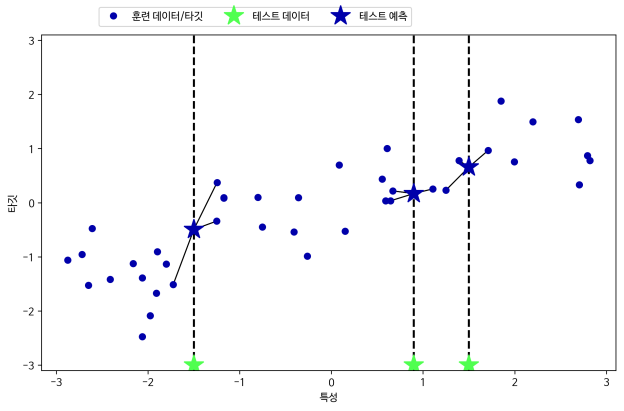
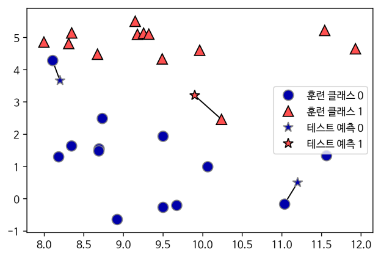
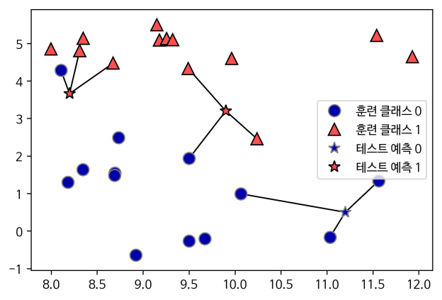
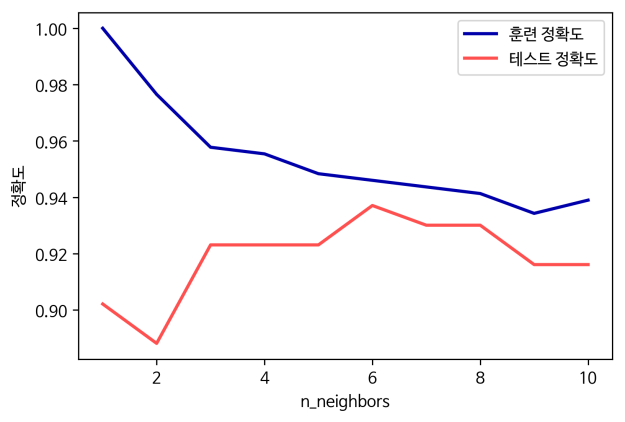
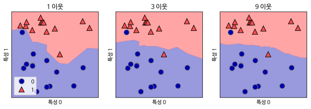
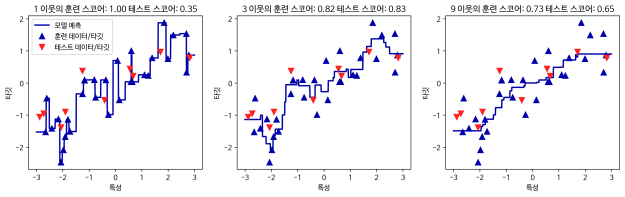

# KNN(k-Nearest Neighbors)
### 정의
### : 거리 기반으로 이웃을 결정하며 새로운 사건이 발생했을 때 가장 근접한 k-이웃의 값을 평균해서 예측하거나 빈도가 많은 클래스로 분류하는 탐색적 기법

### 활용용도
> - 위치측위 : 이동객체의 위치에서 AP 신호강도를 측정하고 이를 KNN 알고리즘을 활용해 **이동객체의 위치를 추정**  
> - 선호도 분류 : 사용자의 **추천정보 기반 성향/구매패턴 분류**  
> - 데이터 필터링 : 포털 등의 **중복, 유사 게시글 필터링**  
> - 고속도로 통행시간 예측 : TCS **교통량** 및 차량 근거리 무선통신(DSRC)을 활용한 **통행시간 예측**

## k-NN(k-최근접 이웃)
### : 새로운 데이터가 주여졌을 때 가장 가까운 k-이웃을 찾고 그 이웃의 값을 평균하거나 다수 클래스( majority voting)로 분류해 새로운 데이터의 값으로 결정

출처 :

[텐서플로우 블로그](https://tensorflow.blog/%ed%8c%8c%ec%9d%b4%ec%8d%ac-%eb%a8%b8%ec%8b%a0%eb%9f%ac%eb%8b%9d/2-3-2-k-%ec%b5%9c%ea%b7%bc%ec%a0%91-%ec%9d%b4%ec%9b%83/)

## 모델 복잡도
### : KNN의 K(이웃 수)의 선택이 중요
- n_neighbors가 작으면 과대적합의 위험이 증가
- n_neighbors가 크면 반대로 과소적합될 가능성 증가

## 결정 경계
### : 일정한 간격으로 생성한 데이터의 예측값을 이용해 결정 경계 구분
> - 실제로 **최근접 이웃에 규칙은 잠재적인 결정 경계를 계산**
> - 결정 경계의 계산 복잡도는 일반적으로 경계의 복잡도 함수가 될 수 있음  

## KNN 모델 생성 : KNeighborsClassifier
sklearn.neighbors.**KNeighborsClassifier(n_neighbors = 5, weight = "uniform", algorithm = "auto", metric = "minkowski", n_jobs = None)**

> **n_neighbors(int, optional)** : 이웃의 수 지정. default(5)  
> **weights(str or callable, optional)** : 예측에 사용되는 가중 함수 지정. default(uniform)  
>    > uniform : 균일한 가중치  
>    > distance : 거리의 역수로 가중치 부여. 가까운 이웃들 간에는 큰 영향값을 가짐(2 -> 1/2, 3 -> 1/3)  

> **algorithm**  
> ball_tree / kd_tree / brute : 근접 이웃을 계산하기 위한 알고리즘. default("auto")  

> **metric(string or callable)**  
> minkowski / euclidean / manhattan / chebyshev : default "minkowski", tree에 사용될 거리 행렬  

> **n_jobs** : 병렬처리를 위한 사용 core 수 지정. default(1). -1 : 모든 core 사용

