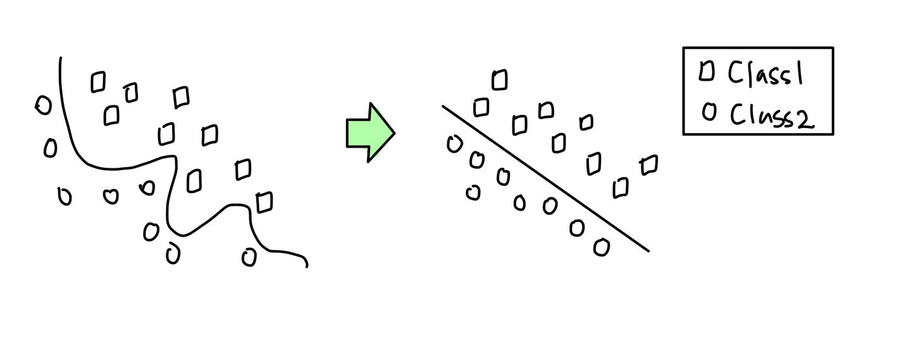
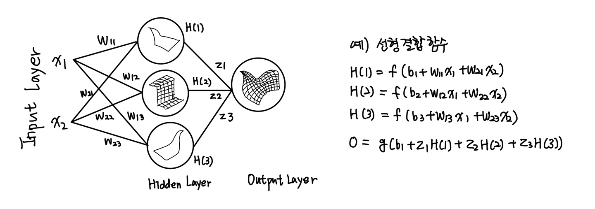

# 인공 신경망(Neural Network)
### 정의
### : 머신 러닝에서의 신경망은 인공신경망(ANN: Artificial Neural Network)을 의미하며 생물학적 신경망 네트워크를 기계학습과 인지과학을 통해 수학적으로 표현한 모델을 의미. 인공 신경망은 노드(뉴런)들의 그룹으로 연결되어 있으며 학습을 통해 시냅스의 결합 세기(가중치)를 조절해 모델을 생성.
#### - 매우 복잡한 비선형 다중 회귀분석

### 활용용도
### : 최근 합성곱 신경망(Convolution NN)의 발달로 활용 분야가 급속히 증가하는 추세
> - 이미지 인식 : 필기체 인식, 사진 분류
> - 의학 분야 : 유전자 분석 연구, 영상 분석, 약품 개발
> - 금융 분야 : 금융사기 탐색 및 예방, 신용평가
> - 로봇 분야 : 물체 인식, 시각/촉각의 구조화

### 단층 신경망(Perceptron)
#### : 단층 신경망 - 다수의 뉴런을 포함하는 숨겨진 층(hidden layer)이 없고 하나의 입력층(Input layer)과 출력층(Output layer)만 존재하는 인공 신경망 모델
#### : 층(layer) - 여러 개의 뉴런 집합
#### : 일반적으로 인공 신경망에서 하나의 뉴런의 Output y는 {0,1}값이거나 [0,1] 사이의 값을 갖도록 설정

### 다층신경망(Multilayer Perceptron)
### * Multilayer ANN : 입력층(Input layer)를 제외한 층을 2개 이상 포함하는 ANN. 이때 입력층과 출력층을 제외한 모든 층을 은닉층(Hidden layer)라 함

> - 분류하고자 하는 **데이터의 분포가 왼쪽**과 같이 생겼을 때, 이런 데이터를 **완벽하게 분리하기 위해서는 다소 복잡한 비선형 형태의 함수(function)가 필요**  
> - **단순한 하나의 층으로 표현 불가능.** 만약 왼쪽의 데이터를 **오른쪽과 같은 형태로 변환이 가능**하다면 단순한 형태의 **선형함수로 분류 가능**  
> 그리하여 **Hidden layer라는 구조를 추가**해 **데이터를 분류와 변환을 실행**하고, **데이터의 차원을 축소**하거나 **증가**시키는 기능 또한 가능  

### * 결합(Combination)함수 : 입력층 또는 은닉층의 마디를 결합. 대부분의 신경망은 결합함수로 선형함수 이용
 

### * 순(forward)/역전파(backward-propagation) : 오차(손실) 최소화를 위한 오류 역전파 및 가중치 조정
순전파 -> 역전파 -> 가중치 조정 -> 순전파 ...의 반복 과정을 통해 오차(손실) 최소화

### * 은닉층(Hidden Layer)
#### : 은닉층 개수와 층별 노드 개수를 지정 -> 은닉층이 복잡할수록 모델의 과대적합 경향성이 나타남
#### : hidden_layer_sizes - 은닉층 개수와 층별 노드 개수
#### - hidden_layer_sizes = ($N_1, N_2, ..., N_k$) : k개 은닉층 지정(1층 - $N_1$개 노드, 2층 - $N_2$개 노드, k층 - $N_k$개 노드)

### * 활성화 함수(Activation Function)
#### : 입력층 또는 이전의 은닉층의 정보(가중 합)을 다음 층으로의 출력값을 결정하는 함수
#### : 비선형 함수. 선형 함수 사용한 은닉층 추가는 은닉층 없는 네트워크와 동일한 기능. 은닉층 추가를 통한 손실 최소화 불가
#### : 퍼셉트론에서는 계단(step)함수 사용하며 신경망에서는 다양한 함수 사용
#### * 종류

#### : 활성화 방식에 따라 출력 또는 소멸 등이 결정되며 자료 특성에 영향을 많이 받음
#### :  activation :  분류 모델 - logistic(sigmoid), tanh, relu 사용 (예측 모델 -  identity)

### * 가중치 최적화 (Solver)
> - 신경망 모델의 학습 결과에 따른 손실함수 값을 최소화하는 하이퍼 파라미터 탐색 및 최적화  
> - 파라미터 초기값 설정 및 탐색 방법에 따라 모델 성능의 차이가 큼  
> - 분석가의 주관, 직관, 경험 등을 고려한 최적화 과정 필요

#### * 종류

#### : 신경망 모델의 학습 결과에 따른 손실함수 값을 최소화하는 하이퍼 파라미터 최적화 방식 지정
#### : 활성화 방식에 따라 출력 또는 소멸 등이 결정되며 자료 특성에 영향을 많이 받음
#### : solver : lbfgs, sgd(확률적 경사 하강법), adam. 일반적으로 adam을 많이 사용

### * 미니배치(Mini Batch)
> - 전체 학습 데이터를 배치 크기로 등분해 각 배치 데이터를 순차적으로 실행하는 방법  
> - Batch GD : Size(미니배치) = Size(전체 데이터)  
> - S-GD : Size(미니배치) = 1  
> - 실행 속도 빠르고 SGD보다 오차율 낮음
#### : 미니 배치 크기에 따라 모델 성능 변화 - train은 과적합, test는 크기가 증가할수록 오차 증가 경향성 있음

## 최신 알고리즘
### * 합성곱 신경망(CNN, Convolution Neural Network)
> - **시각적 이미지를 분석하는 데 사용되는 깊고 forward 인공신경망**  
> - 사물, 영상, 음식 인식 등 다양한 분야에서 활용

### * 순환 신경망(RNN, Recurrent Neural Network)
> - **신경망 유닛 간의 순환적 연결 구조를 가지며 시간적 동적 특징을 표현하는 신경망**
> - 번역, 필기체 인식, 음성인식, 시계열 예측(주식) 등

### NN 분류 모델 생성 : MLPClassifier
sklearn.neural_network.**MLPClassifier**(hidden_layer_sizes = (100,), activation = "relu", solver = "adam", alpha = 0.00001, batch_size = "auto", learning_rage = "constant", max_iter = 200, shuffle = True, random_state = None, early_stopping = False, validation_fraction = 0.1,...)

> hidden_layer_sizes : 은닉층 크기 지정. default(100)  
> activation : 은닉층의 활성화 함수. default(relu)  
>    > identity : 무작동 활성화 함수(연속형 목표 변수). $f(x) = x$  
>    > logistic : logistic sigmoid 함수. $f(x) = \frac {1} {1+e^{-x}}$  
>    > tanh : hyperbolic tangent 함수. $f(x) = tanh(x)$  
>    > relu : rectified linear unit 함수. $f(x) = max(0,x)$  

> solver : 가중치 최적화 방법. default(adam)  
>    > lbfgs : Quasi-Newton 방식의 optimizer. 소량 데이터 적용 시 성능 우수(제한 메모리 사용)  
>    > sgd : stochastic gradient descent optimizer  
>    > adam : stochastic gradient-based optimizer. 대량 데이터 적용 시 성능 우수  

> alpha : L2 penalty (regularization, 규제화) 파라미터. default(0.0001)  
> batch_size : 미니 배치 크기. default(auto = min(200, n_samples))  
> learning_rate : 학습률. 초기 learning_rate_init = 0.001  
> max_iter : 최대 반복 횟수. default(200)  
> random_state : 초기 자료 선택 기준. 값에 따라 선택되는 데이터가 달라짐. default(None)  
* 예측 모델인 sklearn.neural_network.**MLPRegressor** 사용
