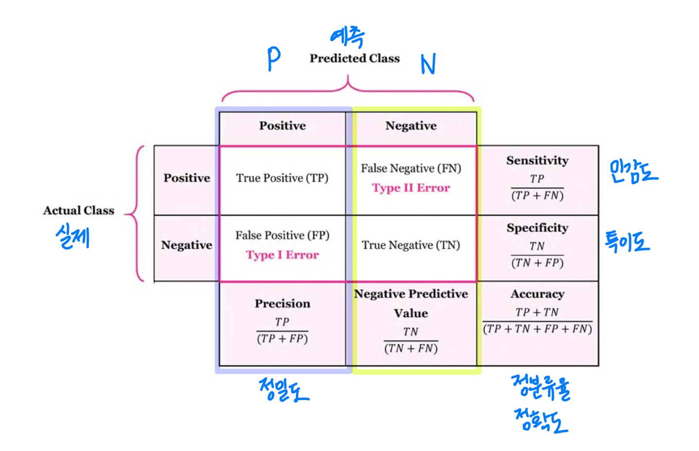
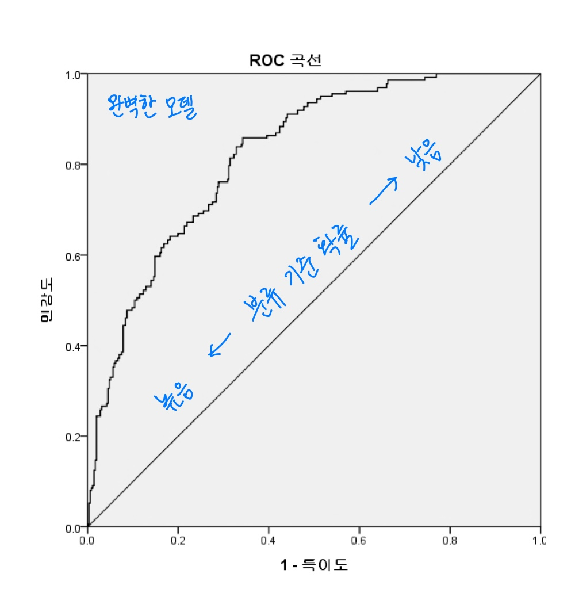
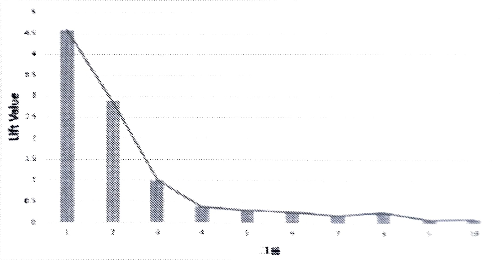
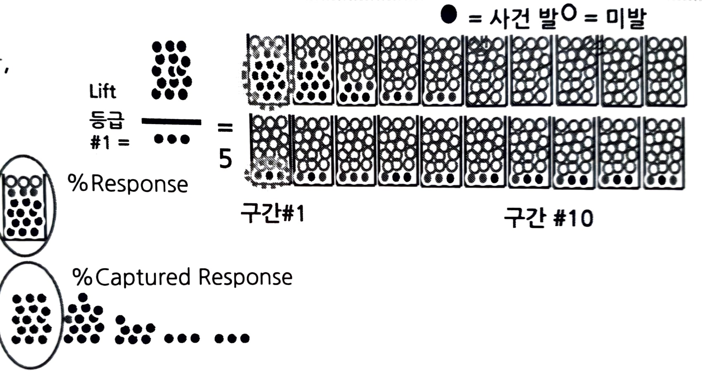

# 모델평가
### 정의 
#### : 예측 또는 분류 목적으로 만든 모델이 무작위로 예측/분류하는 임의의(random) 모델 대비 성능이 우수한지 또는 복수의 모델 중에서 어느 모델의 성능이 가장 우수한 지를 비교, 분석하는 과정
> 일반적으로 Baseline(random) 모델 대비 **성능이 얼마나 우수한지**를 평가  
> - **Baseline(임의)** : 무작위로 예측/분류하는 모델  
> - **User-developed(개발)** : 분석가가 개발한 모델  
> - **Perfect(완전)** : 최적의 예측/분류 성능을 가진 완벽한 모델  

> 모델의 목적은 "좋은" 예측/분류  
> - 특히 **경험하지 않은 미래의 데이터**에 대한 **좋은 예측 및 분류**가 중요

### 성능 추정 절차
> **훈련 데이터를 알고리즘에 입력해 모델을 학습 -> 테스트 데이터의 레이블을 예측 -> 예측과 실제 레이블을 비교해 모델의 분류 정확도 추정**  

### 활용 용도
#### : 모델의 성능 평가 및 개선

### 평가 기준
#### : 일반적으로 모델의 성능 평가는 3가지 기준으로 실시
> - **정확도(Accuracy)** : 분류/예측의 성능이 우수한가?(정확한가?) / 다양한 기법 및 옵션을 변경해 다수의 모델 생성
> - **안정성/일반성** : 동일 모집단의 다른 데이터(test)에 적용 시 유사한 결과가 나오는가? / 교차 검증을 통한 과대적합 확인
> - **효율성(Efficiency)** : 자원(자료, 설명변수 수)을 적게 사용해도 유사한 성능이 나오는가? / 최근에는 효율성의 중요도가 낮아지고 있음

### 평가 절차
> **Step1. 정확도 평가** : 어느 모델의 **예측력**이 가장 우수한가?  
> **Step2. 안정성 평가** : 동일한 예측력 하에서 어느 모델이 **안정적**인가?  
> **Step3. 효율성 평가** : 동일한 예측력, 안정성 하에서 어느 모델이 **효율적**인가?  
> **Step4. 최종모델 선정** : **예측력, 안정성, 효율성**이 가장 우수한 모델 선정  

## 모델 평가 지표
#### : 모델링의 목적 또는 목표변수의 유형에 따라 평가지표가 다름
> **분류(classification) - 목표변수 : 범주(class)**  
>    > 주요 모델 : Logistic Regression / Decision Tree / Random Forest / Gradient Boosting / KNN / Naive Bayesian / Neural Network  
>    > 평가 방법 : Misclassification Rate(Confusion Matrix) / ROC Chart & AUC / F1 Score / LIFT(향상도, %Response, %Captured Response)  

> **예측/회귀(prediction) - 목표변수 : 연속(interval)**  
>    > 주요 모델 : Linear Regreession / Ridge/LASSO/Elastic Regression / Decision Tree / Neural Network  
>    > 평가 방법 : Residual Plot / MSE,RMSE,MAE,MAPE / $R^2$, 수정$R^2$ / AIC, BIC 등 

### 오분류율(Misclassification Rate)
#### : 관측치가 속하는 실제집단과 다른 집단으로 잘못 분류한 비율 (주로 균형 자료에 적용)
#### : 불균형 자료인 경우 오분류율에 대한 해석에 주의해야 함


출처:  

[manisha](https://manisha-sirsat.blogspot.com/2019/04/confusion-matrix.html)

> **정분류율(accuracy)**  
> $$\frac {(실제1, 예측1) + (실제0, 예측0)} {전체 빈도} = \frac {a+d} {a+b+c+d}$$  

> **오분류율(Misclassification)**  
> $ = 1 - 정분류율$  
> $$\frac {(실제0, 예측1) + (실제0, 예측1)} {전체 빈도} = \frac {b+c} {a+b+c+d}$$  

> **민감도(Sensivity)**
> $$실제1(사건)에서의 정분류율 = \frac{실제1, 예측1}{실제1} = \frac{a}{a+b}$$  

> **특이도(Specificity)**  
> $$실제0(사건)에서의 정분류율 = \frac{실제0, 예측0}{실제0} = \frac{d}{c+d}$$


### ROC, AUC
#### : 분류 확률 값을 민감도와 (1-특이도)로 표시한 곡선으로 모델의 성능을 판단
#### : 특정 분류 기준값에 의존하지 않고 모델의 우수성을 비교
- 수신자 운영 특성(Receiver Operating Characteriestic). AUC(Area Under Curve) : ROC 아래 면적  
- 곡선의 **좌측 부분**은 **높은 분류 확률**, 우측 부분은 낮은 분류 확률을 나타냄  



> AUC(Area under the ROC curve) : ROC 곡선의 아래 부분 면적  
>    > AUC = 1 : 완벽한 모델  
>    > 0.9 < AUC < 1 : 매우 정확한 모델  
>    > 0.7 < AUC < 0.9 : 정확한 모델  
>    > 0.5 < AUC < 0.7 : 덜 정확한 모델  

> 임계값(cutoff) 판단 : 민감도와 특이도가 높은 값을 선택  
>    > 민감도와 특이도는 서로 상충(trade-off)하는 성질  

> 다수 모델 비교 : AUC 값이 높을수록 좋은 모델
>    > AUC 영역에 대한 신뢰구간이 겹치는 경우 -> 모델 간 차이 없음
>    > AUC 영역에 대한 신뢰구간이 겹치지 않는 경우 -> 모델 간 차이 있음

### F1 score
#### : 정밀도(precision)와 재현율(recall) 지수를 활용한 분류의 정확도 지수
#### : 불균형 자료(unbalanced, 목표변수가 편향)의 모델 평가에 주로 사용
- $F_1$ : 정밀도와 재현율의 가중치 동일  
- $F_2$ : 가중치(정밀도) < 가중치(재현율)  
- $F_{0.5}$ : 가중치(정밀도) > 가중치(재현율)

**정밀도(precision)** : **예측 긍정(참)**에서 실제 긍정(참)의 비율
> 실제 양성인데 예측이 양성  
> $$\frac {TP}{TP+FP} = \frac{a}{a+c}$$  
> * 주의 : 정상 메일을 spam 메일로 오분류  

**재현율(recall)** : **실제 긍정(참)**에서 예측 긍정(참)의 비율  
> 예측 중 양성을 맞힌 것  
> $$\frac {TP}{TP+FN} = \frac{a}{a+b}$$  
> * 주의 : 실제 암인데 정상으로 오진단  

**F1 점수(F1 score)** : 정밀도와 재현율의 조화 평균  
> $$\frac{2}{\frac{1}{precision}+\frac{1}{recall}}$$

### 향상도(LIFT)
#### : 생성된 모델을 통해 예측된 각 데이터의 사후확률의 순서만을 이용해 모델을 평가, 이득곡선
**%Response**  
> $\frac{해당 등급에서 1의 빈도}{해당 등급 자료 수}$ x 100(%)  

**%Captured Response**
> 전체 사건 대비 해당 등급의 사건 수  
> $\frac{해당 등급에서 1의 빈도}{해당 등급 자료 수}$ x 100(%)  

**Baseline Lift**
> $\frac{전체 자료에서 1의 빈도}{전체 자료 수}$ x 100(%)  
> LIFT : 임의 모델 대비 해당 모델의 향상된 정확도 비율  
> $\frac{해당 등급의 Response}{해당 등급 자료 수}$ x 100(%)

#### LIFT 그래프는 등급이 늘어날수록 값이 떨어짐
- 등급별 사후 확률로 상위 등급에서는 높은 반응률, 하위 등급에서는 더 낮은 반응률을 보여야 함



#### 향상도(LIFT) 계산 사례
**%Response**  
> 예측능력 - Model 추천고객 중 실제반응고객의 비율  
> $\frac{해당 그룹(Bin)에서 부류1(Target=1) 빈도}{해당 그룹(Bin)의 전체 빈도}$ x 100(%)  

**%Captured Response**
> Model 적용 시 효과 - 전체반응고객 중 Model이 실제반응고객을 추천한 비율  
> $\frac{해당 그룹(Bin)에서 부류1(Target=1) 빈도}{전체에서 부류1(Target=1) 빈도}$ x 100(%)  

**% Lift**
> 예측 향상력  - Model을 적용했을 경우, 적용하지 않았을 경우 대비 효과
> $\frac{해당 그룹(Bin)에서 부류1(Target=1) 비율}{전체에서 부류1(Target=1) 비율}$ x 100(%)  


```python
import pandas as pd
df = pd.read_csv("LIFT.csv")
df
```


<div>
<style scoped>
    .dataframe tbody tr th:only-of-type {
        vertical-align: middle;
    }

    .dataframe tbody tr th {
        vertical-align: top;
    }

    .dataframe thead th {
        text-align: right;
    }
</style>
<table border="1" class="dataframe">
  <thead>
    <tr style="text-align: right;">
      <th></th>
      <th>구분</th>
      <th>데이터수</th>
      <th>1 빈도수</th>
      <th>%Response</th>
      <th>%Captured Response</th>
      <th>Lift</th>
      <th>Baseline Lift</th>
    </tr>
  </thead>
  <tbody>
    <tr>
      <th>0</th>
      <td>1</td>
      <td>200</td>
      <td>180</td>
      <td>180/200x100 = 90</td>
      <td>180/300*100 = 60</td>
      <td>90/15 = 6</td>
      <td>300/2000x100 = 15</td>
    </tr>
    <tr>
      <th>1</th>
      <td>2</td>
      <td>200</td>
      <td>90</td>
      <td>45</td>
      <td>30</td>
      <td>3</td>
      <td>NaN</td>
    </tr>
    <tr>
      <th>2</th>
      <td>3</td>
      <td>200</td>
      <td>20</td>
      <td>10</td>
      <td>6.7</td>
      <td>0.67</td>
      <td>NaN</td>
    </tr>
    <tr>
      <th>3</th>
      <td>4</td>
      <td>200</td>
      <td>4</td>
      <td>2</td>
      <td>1.3</td>
      <td>0.13</td>
      <td>NaN</td>
    </tr>
    <tr>
      <th>4</th>
      <td>5</td>
      <td>200</td>
      <td>2</td>
      <td>1</td>
      <td>0.7</td>
      <td>0.07</td>
      <td>NaN</td>
    </tr>
    <tr>
      <th>5</th>
      <td>6</td>
      <td>200</td>
      <td>2</td>
      <td>1</td>
      <td>0.7</td>
      <td>0.07</td>
      <td>NaN</td>
    </tr>
    <tr>
      <th>6</th>
      <td>7</td>
      <td>200</td>
      <td>1</td>
      <td>0.5</td>
      <td>0.3</td>
      <td>0.03</td>
      <td>NaN</td>
    </tr>
    <tr>
      <th>7</th>
      <td>8</td>
      <td>200</td>
      <td>1</td>
      <td>0.5</td>
      <td>0.3</td>
      <td>0.03</td>
      <td>NaN</td>
    </tr>
    <tr>
      <th>8</th>
      <td>9</td>
      <td>200</td>
      <td>0</td>
      <td>0</td>
      <td>0</td>
      <td>0</td>
      <td>NaN</td>
    </tr>
    <tr>
      <th>9</th>
      <td>10</td>
      <td>200</td>
      <td>0</td>
      <td>0</td>
      <td>0</td>
      <td>0</td>
      <td>NaN</td>
    </tr>
  </tbody>
</table>
</div>


```python

```
