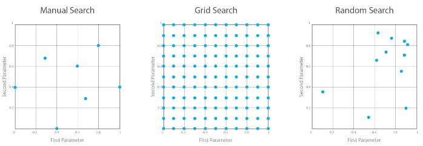

# 예측 모델(Prediction Model)
## 모델링 데이터 구조
### 개요
#### : 분석 목적에 따라 수집된 데이터 구조는 다름. 지도학습 - 목표+설명변수 / 비지도학습 - 설명(입력)변수
#### : 지도학습 데이터는 목표변수의 유형에 따라 예측(연속형) 또는 분류(범주형)로 구분됨

### 데이터 구조 및 적용 모델
- **지도학습**
> 선형/로지스틱 회귀(Regression) / K-최근접 이웃(k-Nearest Neighbors) / 서포트 벡터 머신(SVM) / 결정 트리(Decision Tree) / 앙상블(Random Forest, Boosting) / 신경망(Neural Network) 등  

- **비지도학습**  
> 군집분석(Clustering) / 주성분분석(PCA) / 연관 규칙(Association) / 시각화(Visualization)와 차원  

## 교차 검증(Corss-Validation)
### 정의
#### : 데이터를 훈련용(train, 모델 생성 및 계수 추정)과 검증(valid) / 시험(test)용(모델 성능 평가) 구분해 사용
#### : 하지만 고정된 시험용 데이터로 모델 성능 평가, 파라미터 수정을 반복하면 과적합 발생
#### : 이를 방지하기 위해 훈련용 및 시험용 데이터를 교차 변경해 사용하는 방법  
### 목적 및 활용
#### : 최적의 Hyper Parameter 선택을 통한 좋은 모델 생성
#### : 모델의 안정적인 일반화 성능 확보
#### : 모델의 최적 Hyper parameter 조합 탐색 시 사용 가능

### 특징
- **장점**  
> 모든 데이터를 검증에 활용(특정 검증데이터에 대한 과적합 방지)  
> 더 일반화된 모델 생성 가능  
> 모든 데이터를 훈련에 활용(특히 데이터가 적은 경우 과소적합 방지)  

- **단점**  
> 모델 훈련/평가 시간이 오래 걸림(반복 횟수 증가)  

### 종류 및 특징
- **hold-out**
> 특정 비율로 train/test 데이터 분할. 1번 실행  
- **k-Fold CV**
> k개 fold로 분할하고 test 데이터를 다르게 할당  
> 가장 일반적인 방법. (보통 5~10 fold 사용)  
- **leave-p-out CV**
> 전체 데이터에서 p개 자료를 검증에 사용  
> 반복횟수 : $_nC_p$
- **leave-one-out CV**
> leave-p-out CV에서 p=1인 경우  
> 실행속도 빠르고 많은 데이터를 모델 생성에 사용하므로 모델 성능이 좋은 편임  
> 특히 데이터가 작은 경우 효과적임  

### Grid Search
#### : 모델의 주요 Hyper Parameter 값을 일정 간격으로 조합하면서 최적 성능의 모델을 탐색하는 방법
> 여러 개 Hyper Parameter 조합을 생성/실행해 최적 성능의 모델 실행 조건을 도출
> 상대적으로 조합수가 적을 때 주로 사용하는 방식(실행 소요시간 고려)  
> Hyper Parameter의 Search Space가 클 땐, Randomized Search (무작위 탐색 기법)을 사용

