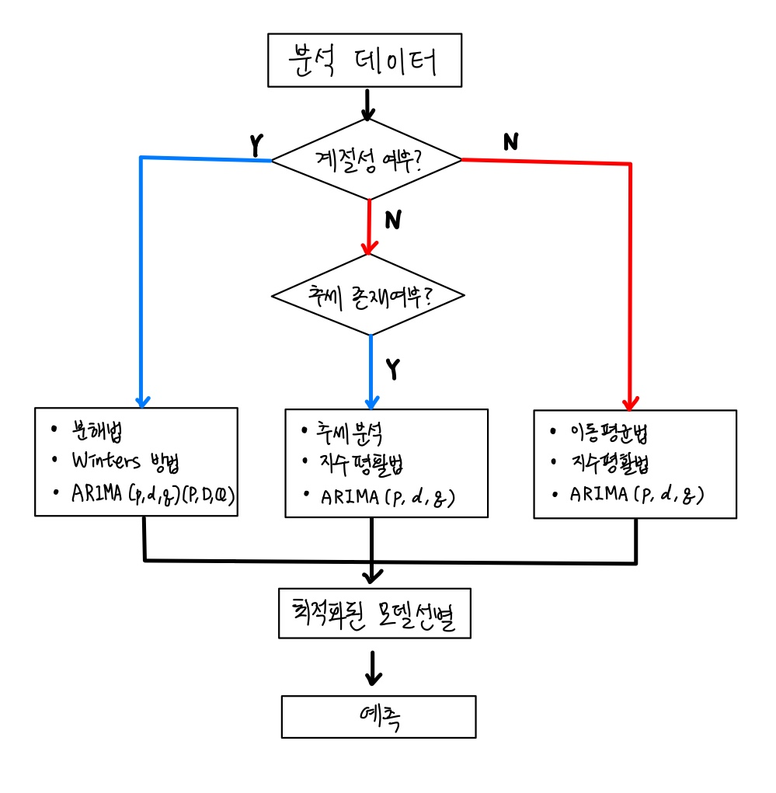

# 시계열 분석(Time Series)
## 정의
### : 시계열 데이터를 분해해 생성한 수학적 모델을 활용해 미래의 값을 예측하는 분석 기법
- 시계열 데이터 : 시간의 흐름에 따라 수집된 데이터

## 분해
### 분해 시계열
#### : 시계열에 내포된 요인별 패턴(추세, 순환, 계절 등)을 데이터에서 분리해 분석하는 방법
> **원 시계열** : 추세, 순환주기, 계절성 및 불규칙 변동이 포함된 복합적인 형태  
> **계절 요인** : 중간 주기(월, 분기, 계절 등)로 유사한 패턴이 반복되는 형태  
> **추세 요인** : 시간 흐름에 따라 증가 또는 감소하는 형태  
> **순환 요인** : 큰 주기(년, 경기 순환 등)로 변화하는 형태  
> **불규칙 요인** : 추세, 순환, 계절 요인으로 설명되지 않는 변동 

## 시계열 분석 방법

## 정상성
### * 정의 : 시계열 데이터의 확률적 성질(평균, 분산)이 시간의 변화에도 변하지 않는(일정한) 상태 또는 성질
- 정상성을 만족하는 경우, 특정한 시점 $t_i$과 $t_{i-k}$의 데이터는 서로 독립적

### * 비정상 시계열 데이터의 정상화
#### : 비정상 시계열 데이터를 변환을 통해 정상성을 확보하는 과정
- 차분을 이용해 추세를 제거하거나 정규성을 만족시킬 수 있는 변환 적용 후 분석(ARIMA) 필요

## AR 모델
### * 정의 : 자기회귀 모델(AR : Auto Regressive model)
- p시점 전 데이터(설명변수)가 현재 시험 데이터(목표변수)에 직접적으로 영향을 주는 회귀모델
$$ Z_t =  \phi_1Z_{t-1} + \phi_2Z_{t-2} + ... + \phi_pZ_{t-p} + a_t $$
$Z_t$ : 현재 시점의 데이터  
$Z_{t-1}, Z_{t-2},...,Z_p$ : 이전, 그 이전,... 시점의 $p$의 데이터  
$\phi_p$ : $p$시점 전의 데이터가 현재 시점 데이터에 어느 정도 영향을 주는지 나타내는 모수  
$a_t$ : 백색잡음(White Noise)으로 오차를 나타냄

### * AR모델 판단
#### 자기상관 함수(ACF: Auto Correlation Function)  : 현재와 p시점 전의 자기 데이터 간의 상관관계(p : 현재 자료와 이전 자료간 시점 차이)

#### 부분 자기상관 함수(Partial Auto Correlation Function) : 모든 다른 시점 데이터들의 영향력을 배제하고 $Z_t$와 $Z_{t-k}$의 둗 시점 데이터 간의 상관관계
#### -> AR모델에서 일반적으로 ACF는 연속적으로 감소하며, PACF는 절단면을 가짐

## MA 모델
### * 정의 : 이동평균 모델(MA : Moving Average model)
- 일정 p 구간의 데이터 평균이 현재 시점의 자신의 데이터에 영향을 주는 추세 분석 모델 설명변수는 특정 구간에서의 자신의 데이터의 평균  
- 시계열의 추세, 주기 등을 파악하기 위함  
$$ Z_t = a_t - \theta_1a_{t-1} + \theta_2a_{t-2} + ... + \theta_pa_{t-p} $$
: 유한한 개수의 백색잡음의 결합으로 항상 정상성을 만족

### MA모델 판단
#### -> AR모델과는 반대로 ACF에서 절단면을 가지며, PACF가 감소

## 차분
### * 정의 : 차분(difference)
- 현재 시점과 p시점 전의 2시점 간의 데이터 차이로, 시계열 데이터의 정상성(증가 또는 감소 추세 제거)을 만족시키기 위해 적용
> 1차 차분 : $\nabla{Z_t} = Z_t - Z_{t-1}$  
> 2차 차분 : $\nabla^2{Z_t} = \nabla{\nabla{Z_t}} = (Z_t - Z_{t-1}) - (Z_{t-1} - Z_{t-2}) = Z_t - 2Z_{t-1} + Z_{t-2}$  

## ARMA(p,q)모델
### : 자기회귀 이동평균 모델(Auto Regression Moving Average Model)
### : AR(p)모델과 MA(q)모델의 결합
- p : 시점 전까지의 데이터가 현재 시점 데이터에 영향을 미침  
- q : $Z_{t-q},...,Z_t$개의 이동평균이 현재 시점 데이터에 영향을 미침

|구분|자기 회귀 AR(p)|이동 평균 MA(q)|자기회귀 이동평균(p,q)|
|:--:|:--:|:--:|:--:|
|자기상관 함수|지수적 감소|q+1차 항부터 절단|q+1차 항부터 지수적 감소|
|부분 자기상관 함수|p+1차 항부터 절단|지수적 감소|p+1차 항부터 지수적 감소|

## ARIMA(p,d,q) 모델
### : 차분된 자기회귀 이동평균 모델(Auto Regression Integrated Moving Average)
### : ARMA 모델에 차분을 더한 모델
- AR(p) + **d 시점 차분,I(d)** + MA(q)

### 시계열 ARIMA 모델 : ARIMA
statsmodels.tsa.arima_model.**ARIMA**(endog, order, exog = None, dates = None, freq = None,...)
> endog(array-like) : 목표변수  
> order(iterable) : ARIMA 파라미터(p,d,q)의 값 지정  
> exog(array-like, optional) : 설명변수. 목표변수와 설명변수를 동시에 지정하면 모델이 변경됨  
> dates(array-like of datetime, optional) : 날짜  
> freq(str, optional) : 입력 데이터의 주기성 지정. D(일), W(주), M(월) 등  

### 모델 적합 : fit
ARIMA.fit(trend = "c", full_output = 1,...)
> trend : 상수 포함 여부 지정  
>    > "c" : 상수 포함  
>    > "nc" : 상수 미포함  
> full_output(bool, optional) : 모든 결과 출력 여부 지정. default(True)

### 자기상관 함수 : plot_acf
statsmodels.graphics.tsaplots.**plot_acf**(x, ax = None, lags = None, use_vlines = True, alpha = 0.05)
> x(array-like) : 시계열 값의 배열  
> ax(Matplotlib AxesSubplot 인스턴스) : 옵션, 그래프 옵션  
> lags(int or array-like) : lag 수 지정  
> use_vlines(bool) : 수직선 사용. default(True)  
> alpha(scalar) : 옵션, 신뢰구간 alpha

### 부분 자기상관 함수 : plot_pacf
statsmodels.graphics.tsaplots.**plot_pacf**(x, ax = None, lags = None, use_vlines = True, alpha = 0.05)
> x(array-like) : 시계열 값의 배열  
> ax(Matplotlib AxesSubplot 인스턴스) : 옵션, 그래프 옵션  
> lags(int or array-like) : lag 수 지정  
> use_vlines(bool) : 수직선 사용. default(True)  
> alpha(scalar) : 옵션, 신뢰구간 alpha
